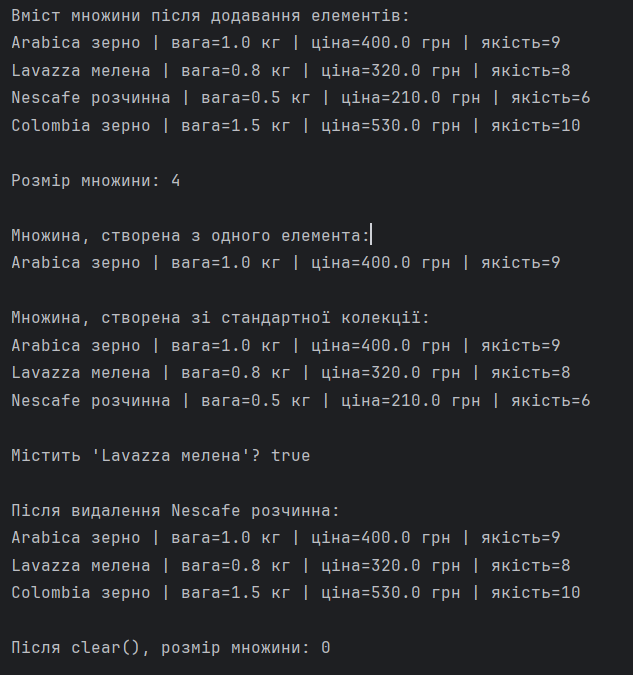

# Лабораторна робота №6 – Колекції

## Варіант: 11

C2 = 1 - інтерфейс `Set`  
C3 = 2 - внутрішня структура - двозв'язний список

Тип елементів колекції - узагальнений клас `Coffee` з лабораторної роботи 5.

## Опис

Власна типізована колекція `CoffeeSet`, яка:

- реалізує інтерфейс `Set<Coffee>`;
- використовує двозв'язний список (на базі класу `Node`) як внутрішню структуру даних;

У класі `Lab6Collections` виконано демонстрацію роботи колекції:
- створення множини різними конструкторами;
- додавання та перевірка унікальності елементів;
- перевірка методів `contains`, `remove`, `clear`;
- ітерація по елементах.
## Результат
